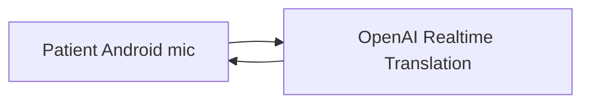
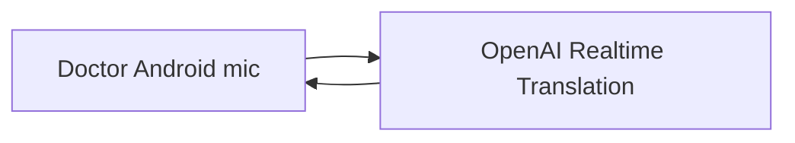
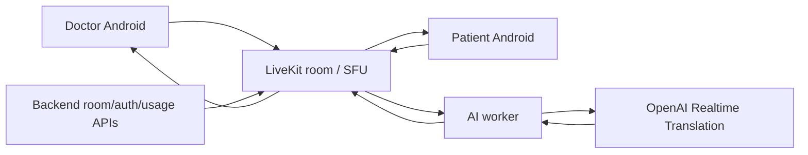
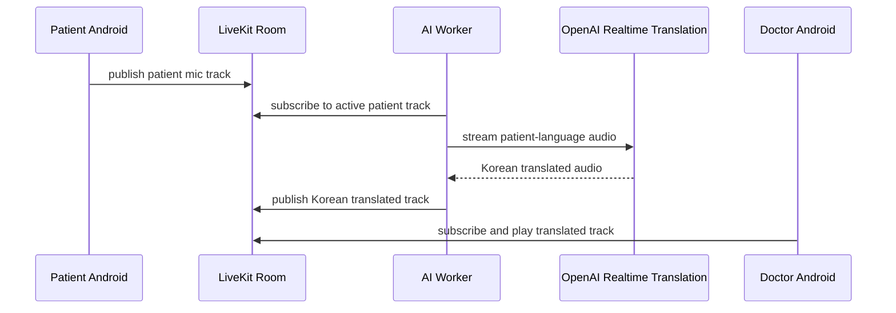
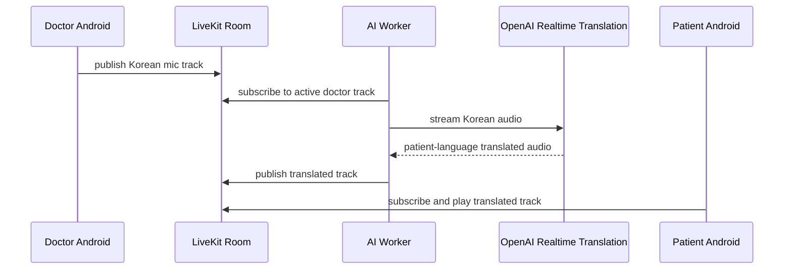

# Android Two-Device Spike Result

## Summary

The first Android WebRTC spike proved that OpenAI Realtime Translation can run on a real Android device through:

- `POST /v1/realtime/translations/client_secrets`
- `POST /v1/realtime/translations/calls`

The Android app successfully sent microphone audio to OpenAI and received translated audio as a playable remote WebRTC audio track.

This resolves the first major unknown: Android can play translated audio returned by OpenAI Realtime Translation.

It also exposes the next product architecture problem: in a two-device doctor/patient room, the translated audio returns to the device that owns the OpenAI peer connection, not automatically to the opposite participant.

## Confirmed Android Fixes

The initial Android run crashed inside the WebRTC network thread:

```text
Fatal error in: ../../../sdk/android/src/jni/jvm.cc, line 81
Fatal signal 6 (SIGABRT) in network_thread
```

Logcat showed the actual cause:

```text
java.lang.SecurityException:
ConnectivityService: Neither user nor current process has android.permission.ACCESS_NETWORK_STATE.
```

The fix was to add:

```xml
<uses-permission android:name="android.permission.ACCESS_NETWORK_STATE" />
```

The spike also moved WebRTC runtime initialization to a process-level initializer so `PeerConnectionFactory.initialize(...)` is not called repeatedly per connection.

Cleanup was made explicit:

- close, unregister, and dispose the data channel
- close and dispose the peer connection
- disable and dispose the local audio track
- dispose the audio source
- dispose the peer connection factory
- release the audio device module

Build verification passed:

```text
./gradlew :app:assembleDebug
BUILD SUCCESSFUL
```

## Successful Runtime Signals

The successful Android run produced the important signals:

```text
token response: 200
token fetched
WebRTC runtime initialized
local offer created
posting offer to OpenAI calls endpoint
calls response: 201
remote track: kind=audio ... enabled=true
add stream: realtimeapi
remote answer set
ice=CONNECTED
ice=COMPLETED
data channel=OPEN
event: session.created
event: output_audio_buffer.started
```

Most importantly, translated audio was heard from the Android device.

## Product Architecture Finding

Direct Android-to-OpenAI sessions are enough to prove Android media compatibility, but they are not enough for the two-device product.

Example patient-to-doctor path with direct sessions:



The patient phone receives the Korean translated audio because the patient phone owns the OpenAI peer connection. In the product, that Korean audio must be heard by the doctor device.

The same issue applies in the other direction:



The doctor phone receives the patient-language translated audio, but the patient device must play it.

## Rejected Primary Path

One possible workaround is for each Android app to connect directly to OpenAI and then forward the received translated audio to the opposite Android app.

This is not recommended as the primary MVP architecture because it requires custom realtime media transport between phones:

- capturing or forwarding a received WebRTC remote audio track
- custom signaling
- ICE and NAT traversal between devices
- reconnect handling
- jitter and buffering behavior
- audio route and lifecycle handling on both phones

That path effectively turns the app into a custom SFU or relay implementation, which is too much media infrastructure risk for the MVP.

## Recommended Two-Device Architecture

Use:

- Android doctor app
- Android patient app
- LiveKit or equivalent SFU
- AI translation worker
- OpenAI Realtime Translation owned by the worker
- existing backend for room, auth, token, and usage APIs



### Patient-To-Doctor Flow



### Doctor-To-Patient Flow



## Layer Responsibilities

Android apps:

- microphone capture
- translated audio playback
- push-to-talk UX
- audio route control
- room join and leave UI
- device lifecycle handling

LiveKit or SFU:

- room media transport
- audio track publish and subscribe
- reconnects
- mobile network changes
- participant identity
- track mute and unmute
- subscriber routing

AI worker:

- OpenAI session ownership
- active speaker routing
- translation direction selection
- OpenAI audio input and output bridging
- publishing translated audio tracks back to the room
- usage and health events

Backend:

- staff authentication
- room creation and termination
- temporary patient links
- LiveKit room and participant tokens
- hospital-level usage tracking
- admin dashboard APIs

## Security Rules

- Never expose permanent OpenAI keys to Android clients.
- Android clients may receive short-lived, room-scoped LiveKit participant tokens.
- The AI worker owns OpenAI Realtime sessions.
- Patient links remain temporary and room-specific.
- Store only essential metadata.
- Do not store raw voice audio.
- Do not store full consultation transcripts by default.

## Turn-Taking Model

Keep the MVP one-speaker-at-a-time.

Room states:

- `idle`
- `doctor_speaking`
- `doctor_translating`
- `patient_speaking`
- `patient_translating`
- `ended`

Only the active speaker track should be routed to OpenAI. The opposite participant receives translated audio. During translated audio playback, the opposite mic can be blocked or muted if needed to reduce echo and feedback.

## Next Spike Plan

The next technical spike should focus only on two-device media routing.

### Phase 1: LiveKit Room Basics

- create a LiveKit room
- doctor Android joins
- patient Android joins
- both publish microphone tracks
- both subscribe to remote tracks

### Phase 2: AI Worker Audio Subscribe

- AI worker joins the same room
- worker subscribes to the active speaker track
- worker confirms it receives PCM or decodable audio frames

### Phase 3: OpenAI Bridge

- worker connects to OpenAI Realtime Translation
- worker forwards active speaker audio to OpenAI
- worker receives translated audio from OpenAI

### Phase 4: Translated Track Publish

- worker publishes translated audio track to LiveKit
- opposite Android device subscribes and plays it

### Phase 5: Product Controls

- push-to-talk state sync
- room termination
- minimal usage events
- no translated audio plays on the wrong device

## Success Criteria

Minimum success:

- patient phone speaks English, Chinese, or Japanese
- doctor phone hears Korean translated audio within about 1 to 2 seconds
- doctor phone speaks Korean
- patient phone hears translated audio within about 1 to 2 seconds

Additional success signals:

- reconnect after network interruption
- room termination stops audio
- push-to-talk state sync works
- no translated audio plays on the wrong device
- no raw audio is stored
- usage events can be counted at hospital and room level

## Decision

Proceed with:

- Android apps
- LiveKit/SFU media room
- AI worker owning OpenAI Realtime Translation sessions
- backend room/auth/usage APIs

Do not rely on direct Android-to-OpenAI sessions alone for the two-device product.
