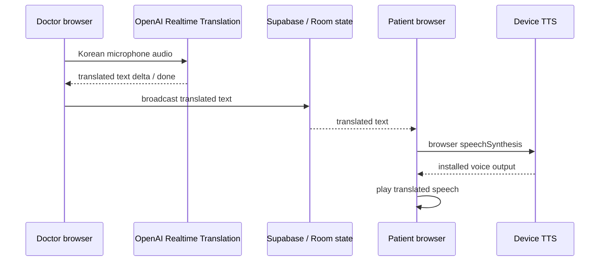
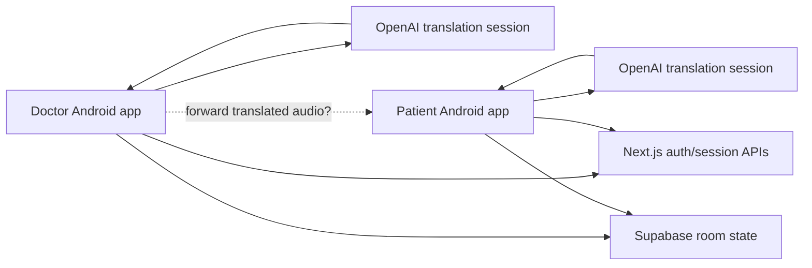
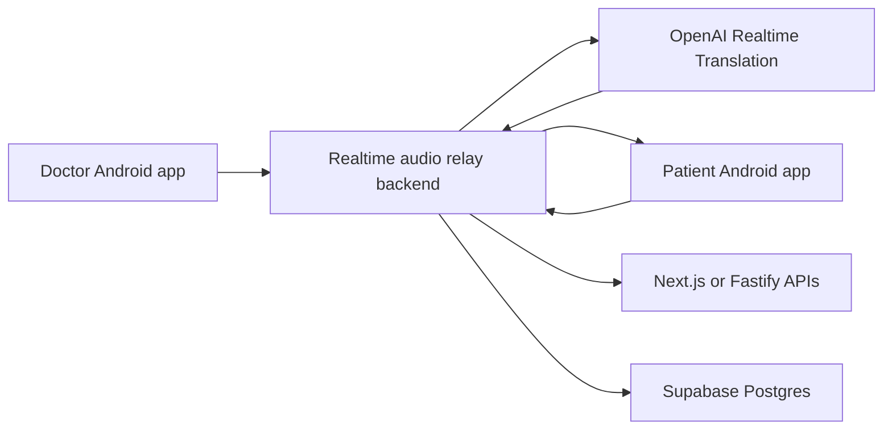
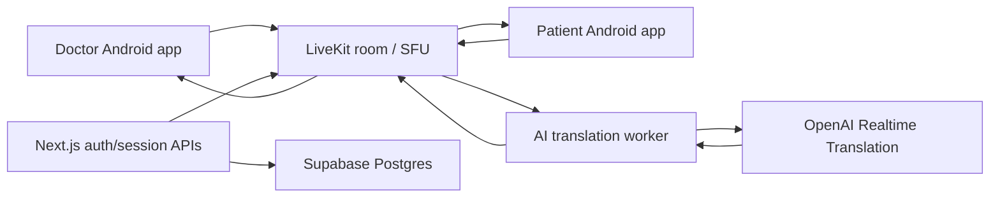
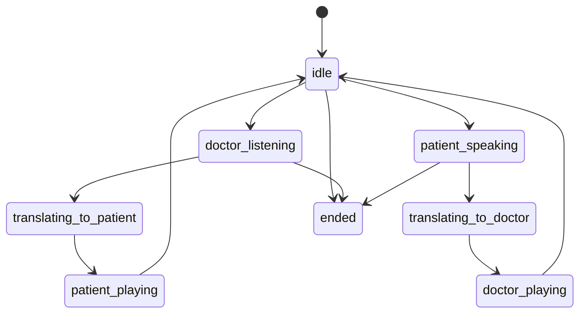

# Android Transition Architecture

## Decision

Clinic Voice Room should move from a browser-first MVP to a hospital-provisioned Android two-device product.

The web MVP proved the core workflow: staff login, room creation, guest join, push-to-talk, procedure mode, translated text, TTS playback, room state, and usage tracking. The next product risk is not another web UI iteration. The next product risk is low-latency, reliable, hands-minimal translated audio between two managed Android devices.

## Product Target

- Doctor device: hospital-provisioned Android phone with wired or Bluetooth earphone microphone.
- Patient device: hospital-provisioned Android phone near the bed or consultation seat.
- iOS: out of scope.
- Patient personal phone: optional later, not required for the default deployment.
- Web: keep for staff/admin setup and usage review, not for the core treatment-room audio path.

## Why Android

Android gives the product direct control over the operational problems that made the web MVP fragile:

- microphone permission and capture lifecycle
- audio route selection for earphone, speaker, Bluetooth, and receiver
- screen-on behavior during procedures
- foreground service behavior for long sessions
- device provisioning and kiosk-like operation
- consistent hardware profile per hospital deployment

Android does not automatically make OpenAI inference faster. The speed improvement must come from removing the current text-to-TTS relay and using realtime audio output as the primary media path.

## Current Web MVP Audio Path

This is reliable enough for an MVP, but it creates avoidable delay:

- translation must complete enough text before playback
- playback quality depends on the receiving device's installed TTS voice
- missing language voice data can produce poor accents
- browser autoplay and audio output policies add more variance

## Target Audio Principle

Use OpenAI Realtime translated audio as the primary output. Use text plus device TTS only as a fallback path.

OpenAI's current Realtime WebRTC documentation says model audio output is delivered to the connected client as a remote media stream, and OpenAI recommends WebRTC rather than WebSocket for client devices on uncertain networks. The generic Realtime API also supports native audio input and output without chaining speech-to-text, text generation, and TTS.

Sources:

- [OpenAI Realtime WebRTC guide](https://platform.openai.com/docs/guides/realtime-webrtc)
- [OpenAI Realtime model capabilities](https://platform.openai.com/docs/guides/realtime-model-capabilities)
- [OpenAI Realtime API reference](https://platform.openai.com/docs/api-reference/realtime)
- [OpenAI Realtime client secrets reference](https://platform.openai.com/docs/api-reference/realtime-sessions/create-realtime-client-secret)

Important nuance: the web MVP currently uses translation-specific endpoints:

- `POST https://api.openai.com/v1/realtime/translations/client_secrets`
- `POST https://api.openai.com/v1/realtime/translations/calls`

Those endpoints are not the same public generic Realtime endpoints shown in the general docs. The first Android spike must verify the exact media behavior of the translation-specific calls endpoint on Android: remote audio track availability, event names, output language config, and whether translated audio arrives before or only after transcript completion.

## Core Architecture Options

### Option A: Android Apps + Existing Next/Supabase + Direct OpenAI Sessions

This is the fastest spike path because it keeps the current backend and tests native Android WebRTC against OpenAI directly.

The unresolved issue is audio ownership. OpenAI returns translated audio to the app that owns the OpenAI peer connection. For doctor-to-patient speech, the doctor app receives the translated patient-language audio, but the patient device must play it. Forwarding a received WebRTC remote track from one Android app to another app is possible in principle but becomes custom realtime media infrastructure: signaling, ICE, reconnects, NAT, buffering, and audio route management.

Verdict: good for the first proof-of-audio spike, weak as the final product architecture unless the forwarding test is surprisingly simple and stable.

### Option B: Android Apps + Dedicated Backend Relay

The backend becomes the owner of OpenAI sessions and relays translated audio to the other phone. This centralizes secrets, observability, and session control.

The downside is that building a production-grade audio relay is easy to underestimate. The backend must terminate or bridge realtime media, handle jitter, publish audio frames, recover sessions, and avoid becoming a fragile custom SFU.

Verdict: reasonable if the relay stays narrow and uses a proven media layer. Risky if hand-rolled.

### Option C: Android Apps + LiveKit/SFU + AI Translation Worker

In this model, the Android apps publish microphone tracks into a managed realtime media room. An AI worker subscribes to the active speaker track, sends audio to OpenAI Realtime Translation, receives translated audio, and publishes a translated audio track back into the same room for the opposite participant.

This is the cleanest product architecture because each layer has one job:

- Android app: capture, playback, device control, simple UX
- SFU: realtime audio transport, reconnection, track routing
- AI worker: OpenAI session ownership, translation direction, fallback TTS
- Next/Supabase: auth, hospital/account metadata, room lifecycle, usage events

LiveKit has official Android SDK support and is designed for realtime audio/video transport. mediasoup is powerful, but usually requires more custom signaling and native-client integration work. For this product, LiveKit is the better first SFU candidate unless a later constraint requires lower-level control.

Sources:

- [LiveKit transport overview](https://docs.livekit.io/transport)
- [LiveKit Android quickstart](https://docs.livekit.io/transport/sdk-platforms/android/)
- [mediasoup documentation](https://mediasoup.org/documentation/)
- [Supabase Realtime Broadcast docs](https://supabase.com/docs/guides/realtime/broadcast/)

Verdict: recommended target architecture for a serious hospital-device product.

## Recommended Path

### Phase 1: Android OpenAI Audio Spike

Goal: prove the translation-specific OpenAI WebRTC call on Android.

Build a tiny Kotlin app with:

- one screen
- language selector
- microphone permission
- start/stop call
- WebRTC peer connection to `realtime/translations/calls`
- server-issued ephemeral token from the existing Next.js endpoint
- remote audio track playback on the same device
- data channel logging for transcript and lifecycle events

Acceptance criteria:

- Korean input produces translated audio output on Android.
- Japanese, Chinese, and English modes produce audio, not only transcript text.
- remote audio starts before a separate TTS request would have completed.
- session survives at least 10 minutes of repeated short utterances.
- wired earphone mic and phone speaker routing are both testable.

This phase does not need two phones yet. It answers the most important unknown: does the OpenAI translation session produce usable translated audio on Android through WebRTC?

### Phase 2: Two-Device Routing Spike

Run two experiments, then choose:

1. Direct forwarding experiment: doctor app receives OpenAI translated audio and forwards it to patient app over a second WebRTC connection.
2. SFU experiment: doctor app publishes Korean mic audio to LiveKit; an AI worker subscribes, calls OpenAI, and publishes translated audio to patient app.

Acceptance criteria:

- perceived doctor-to-patient latency is usually 1 to 3 seconds for short procedural phrases
- patient-to-doctor button speech returns Korean audio to the doctor earphone
- session recovers from screen off/on, network change, and app foreground/background transitions
- no raw audio or full transcript is stored

Expected outcome: choose the SFU/AI-worker architecture unless direct forwarding is both simpler and measurably reliable.

### Phase 3: Product App MVP

Build the real two-device Android app:

- automatic login or device provisioning
- device role: doctor or patient
- hospital/room pairing
- consultation mode: push-to-talk or semi-automatic
- procedure mode: doctor auto-listen, patient large speak button
- translated audio playback
- visible fallback text
- room end
- usage metering
- diagnostics screen for staff setup

## Android Technology Choice

Use Kotlin native first.

Reasons:

- best control over Android audio APIs
- easier foreground service and wake-lock handling
- direct access to WebRTC SDKs and LiveKit Android SDK
- simpler managed-device provisioning
- the UI is operational, not content-heavy

React Native or Flutter can work, but they add another layer exactly where the product needs direct control: audio routing, lifecycle, and realtime media. They are better candidates only if a much larger cross-platform UI becomes necessary later. iOS is out of scope, so that benefit is low.

## Proposed Runtime State Machine

Keep the state machine deliberately small.

State ownership:

- the app owns local capture/playback state
- the backend owns room lifecycle and authorization
- the SFU owns media track presence
- Supabase Realtime or LiveKit data messages can carry lightweight state events

Avoid carrying vague UI states like "other side is speaking" after playback. Instead, derive display from active capture/playback state and reset aggressively when the media event ends.

## Supabase Role After Android Transition

Keep Supabase for:

- hospital/account metadata
- staff users and roles
- room records
- device pairing metadata
- usage counters and speaking events
- admin dashboard queries

Reduce Supabase Realtime to lightweight control events:

- room created
- participant joined
- mode changed
- active speaker changed
- room ended
- fallback text message available

Do not use Supabase Realtime as the primary audio transport. It is a JSON/event channel, not a realtime media path.

## OpenAI Session Design

Initial session direction:

- doctor input Korean, output patient language
- patient input patient language, output Korean

For procedure mode, use two logical translation directions:

- doctor-to-patient: automatic listening, short phrase segmentation
- patient-to-doctor: explicit button capture

Use device TTS as fallback only:

- if realtime translated audio is unavailable
- if the remote audio track fails
- if a specific language has repeated audio-output failures
- if glossary post-processing must be forced for a phrase

## Glossary Strategy

Current finding: the translation-specific token API rejected `session.instructions` in the existing MVP. Do not assume glossary prompts can be injected into that session.

Recommended strategy:

1. Keep `src/lib/clinic-glossary.ts` as the canonical glossary source for now.
2. In realtime mode, log mismatches and display corrected fallback text when possible.
3. For critical terms, build a phrase-shortcut layer in the Android app for predefined treatment phrases.
4. Test whether the current Realtime API `prompt` object or a supported session-update event can influence translation sessions. Treat this as unproven until tested against the translation-specific endpoint.
5. Keep text-first phrase shortcuts for glossary-critical phrases where exact brand/procedure naming matters.

## Backend Shape

Keep the existing Next.js backend in the near term:

- staff login
- room creation
- room end
- usage APIs
- OpenAI ephemeral token issuance
- LiveKit token issuance if Option C is selected

Add a dedicated worker only when SFU routing starts:

- subscribe to source audio tracks
- own OpenAI translation sessions
- publish translated audio tracks
- emit usage and health events

This can begin as a Node worker if it integrates cleanly with the chosen SFU. If media handling becomes awkward, split it into a dedicated service without changing the web dashboard.

## What To Keep From The Web MVP

- Prisma schema concepts: hospital, staff, room, usage events
- staff/admin authentication flow
- room lifecycle APIs
- patient language list
- usage dashboard
- glossary file
- security rule: permanent OpenAI keys remain server-side

## What To Retire Or Downgrade

- QR-first patient personal phone assumption
- browser as the main procedure-room client
- translated text as the primary transport
- server-side translated-speech generation
- complex browser autoplay workarounds
- browser room-state polling for active audio UX

## Security And Retention

- Never expose permanent OpenAI, Supabase service role, or SFU admin keys to Android clients.
- Issue short-lived tokens from the backend.
- Bind room/device tokens to hospital, room, role, and expiration.
- Store only metadata and usage counters.
- Do not store raw audio.
- Do not store full consultation transcripts by default.
- Keep fallback text ephemeral unless explicitly needed for debugging with consent.

## Immediate Engineering Tasks

1. Follow [ANDROID_SPIKE_PLAN.md](ANDROID_SPIKE_PLAN.md) for the first one-device Kotlin/OpenAI audio spike.
2. Create a separate `android/` spike project or a sibling repository for Kotlin experiments.
3. Add a backend endpoint that can issue Android-compatible OpenAI translation session tokens using the existing room authorization.
4. Build the one-device Android OpenAI audio spike.
5. Capture event logs for `zh`, `ja`, `en`, `ru`, `vi`, and `id`.
6. Measure latency from speech stop to first translated audio.
7. Run the two-device SFU spike with LiveKit if Phase 1 confirms usable translated audio.
8. Decide whether the Next.js app remains the main backend or whether a small Fastify worker/service is introduced for media.

## Open Questions

- Does `gpt-realtime-translate` on `realtime/translations/calls` always expose translated audio as a normal remote WebRTC audio track on Android?
- Does it stream partial translated audio, or wait until the model has enough translated content?
- Are translation-specific sessions supported over WebSocket, or only WebRTC calls?
- Can translation-specific sessions accept a supported `prompt` reference or session update for glossary behavior?
- What is the best audio frame handoff from OpenAI output to LiveKit published track?
- Which Android devices and earphone microphones will be standardized for the hospital package?

## Current Spike Result

The one-device Android OpenAI spike passed. Android successfully connected to `POST /v1/realtime/translations/calls`, received a remote audio track, and played translated audio on the device.

The result confirms Android media compatibility, but it also confirms the two-device routing problem: translated audio returns to the device that owns the OpenAI peer connection. Direct Android-to-OpenAI sessions alone do not deliver translated audio to the opposite phone.

See [ANDROID_2_DEVICE_SPIKE_RESULT.md](ANDROID_2_DEVICE_SPIKE_RESULT.md) for the captured result and next LiveKit/SFU spike plan.

## Current Recommendation

Move forward with Kotlin Android and the two-device SFU spike:

1. verify LiveKit room publish/subscribe between doctor and patient Android devices
2. verify an AI worker can subscribe to active speaker audio
3. verify the worker can bridge active speaker audio to OpenAI Realtime Translation
4. verify the worker can publish translated audio back to the opposite device

Option C is now the recommended target architecture. Keep the current web MVP as the admin/control plane rather than the core realtime interpretation surface.
